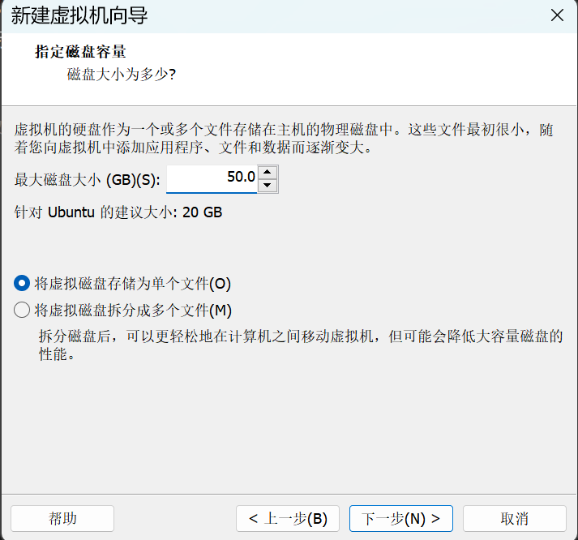
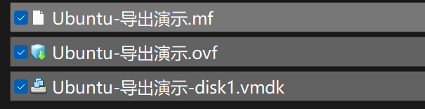
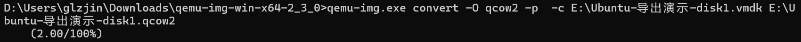

# 外部出题-虚拟机镜像制作要求
1.  使用 VmWare Workstation 来进行制作。
2.  在创建虚拟机的时候，请选择“将虚拟磁盘存储为单个文件”。
    
    
    
3.  制作完成后，在其中执行如下命令：

*   a. 对于 Linux 机器：
    
    ```
    cd /opt
    wget https://csrtest-1251267611.cos.ap-chengdu.myqcloud.com/greeninit.tar.gz
    tar xvzf greeninit.tar.gz
    cd greeninit
    bash install.sh
    ```
    
    b. 对于 Windows 机器：
    
    请按照这两篇文章里的内容安装相关组件：
    
    \- 安装驱动：[https://cloud.tencent.com/document/product/213/17815](https://cloud.tencent.com/document/product/213/17815)
    
    \- 安装 Agent: [https://cloud.tencent.com/document/product/213/30000](https://cloud.tencent.com/document/product/213/30000)
    

       4. 安装完成后，导出为 ovf。



      5. 下载 qemu-img 工具，进行转换。



      6. 将转换后的文件上传到百度云，设置分享链接永久有效，备用。