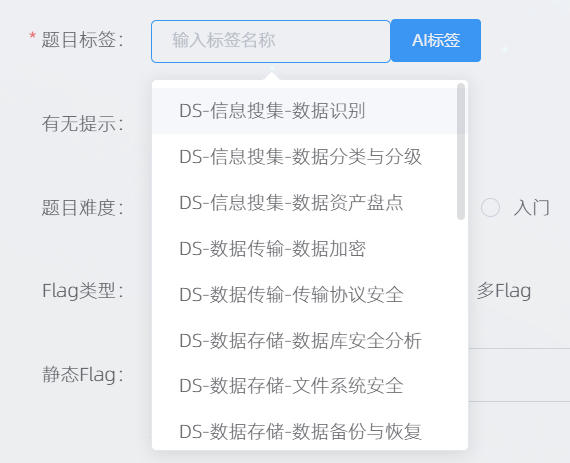
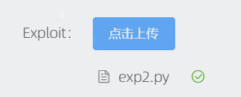
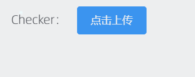
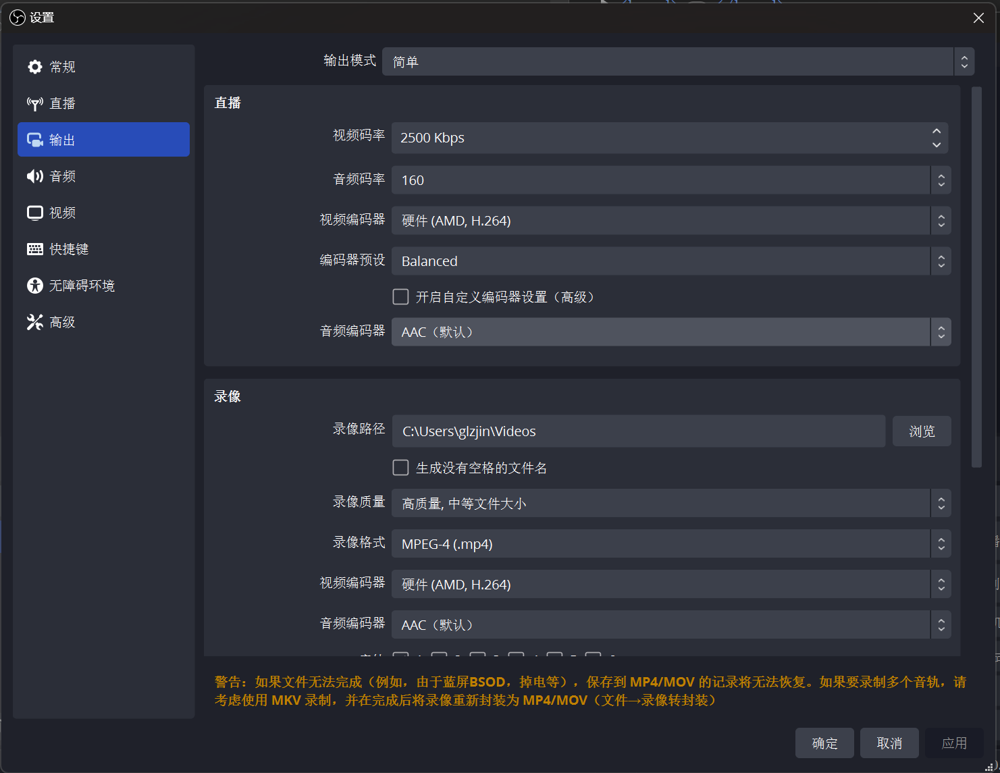

# 填写指南
题目名
---

题目的名字，尽量多样化，避免 ez，baby 等名词简单堆砌。


题目附件
----

题目的附件，会在选手解题时提供给选手，请以 zip 格式压缩后上传。


容器文件
----

对于 DS 题来说，在需要的情况下，可以有环境文件，也就是 Dockerfile。

Dockerfile 标准请查看 [Dockerfile 文件内容制作指南](../../ETH%EF%BC%88%E5%8C%BA%E5%9D%97%E9%93%BE%E5%AE%89%E5%85%A8%EF%BC%89/%E4%B8%8A%E4%BC%A0%E5%86%85%E5%AE%B9%E6%A0%87%E5%87%86/Dockerfile%20%E6%96%87%E4%BB%B6%E5%86%85%E5%AE%B9%E5%88%B6%E4%BD%9C%E6%8C%87%E5%8D%97.md)。

最终上传文件时请使用 zip 格式压缩上传。


题目标签
----

**在选择题目标签之前，请先按照“题目类型”处所示步骤，选择正确的题目分类。**

请点击“+ New Tag”按钮来新增标签。


选择与题目对应的知识点标签。



添加完一个标签后，可以继续点击“+ New Tag”按钮来添加下一个标签。


注意：可以使用AI来选择标签！在下面将解题思路上传之后，可以点击AI标签按钮来让AI自动选择题目匹配的知识点标签。

有无提示
----

如有需要给到选手的提示，请点开这个开关，然后在提示栏输入要给出的提示，语言要精简。


题目难度
----

选择匹配的题目难度。

对于DS题目来说，难度定义如下：

*   入门：涉及到 1 个知识点，选手平均解题所需时间约20分钟左右。
*   简单：涉及到 1~2 个知识点，选手平均解题所需时间约40分钟左右。
*   中等：涉及到 2~3 个知识点，选手平均解题所需时间约60分钟左右。
*   困难：涉及到 3~4 个知识点，选手平均解题所需时间约90分钟左右。

依据题目难度选择对应的难度即可，最终评价难度以审核人审核为准。


Flag类型
------

对于ETH题来说：

1.  有环境的题目： 均强制要求 **动态Flag**。

再次强调，请在题目容器文件中接收 “**DASFLAG**” 环境作为 flag！


      2. 无环境的题目可以选择 静态Flag，填写flag即可。

          flag只需要填写 DASCTF{} 括号里的内容即可，比如 flag 是 DASCTF{xxxxx}，那么只需要填写 xxxxx 即可。


题目类型
----

选择“DS（数据安全）”即可。


题目步骤
----

点击“+ New Step”按钮即可添加新的步骤。


多次点击“+ New Step”按钮可以多次添加步骤。


请在此处以简洁精炼的语言说明题目的解题步骤，**不可直接拷贝解题思路里的文段**！

题目描述
----

这里的文字是选手解题的时候展示给选手的描述性文字，便于选手了解题目大致的考察内容。


备注
--

这里的文字是展示给审核员查看的文字，出题人可以在此处给审核人一些说明。最终选手解题的时候不会看到这里的文字。


题目源码
----

需要在此处把环境中所有的程序源码投递一份。


Exploit
-------

**所有DS题目都需要提交EXP脚本！**

1.  对于有环境的题目：
    1.  Exp脚本，请务必按照此格式编写 EXP，接收 目标IP，目标端口，预期FLAG 三个参数，**如写死这些参数，直接不通过！**

```python
#!/usr/bin/python
#  -*- coding: utf-8 -*-
import sys
from pwn import *

# 输入为靶机 IP 和端口以及要验证的 flag
HOST = sys.argv[1]
PORT = int(sys.argv[2])
EXPECTED_FLAG = sys.argv[3]

# exp 函数
def exp(ip, port):
    # 连接到靶机
    conn = remote(ip, port)
    
    # 构造 Payload
    # 这里根据具体的 PWN 场景构造你的 payload
    payload = b"A" * 64  # 示例 payload，通常需要根据具体的漏洞情况进行调整
    
    # 发送 Payload
    conn.sendline(payload)
    
    # 接收响应
    response = conn.recvall(timeout=2).decode('utf-8')
    
    # 关闭连接
    conn.close()
    
    # 匹配 FLAG
    match_group = re.findall("DASCTF{(.*?)}", response)
    if match_group:
        flag = match_group[0]
    else:
        flag = None

    return flag

# 主逻辑
if __name__ == '__main__':
    flag = exp(HOST, PORT)
    if flag and flag == EXPECTED_FLAG:
        print("Pass!")
    else:
        print("Fail!")
```

2\. 对于无环境的赛题：

Exp里涉及密文的解密过程即可。

```
 #!/usr/bin/python
#  -*- coding: utf-8 -*-
import sys


# 示例密文（在实际题目中，这个密文可能是从某个文件或其他来源获取的）
ciphertext = "ENCRYPTED_FLAG_HERE"

# 解密函数（需要根据具体逆向题目的算法实现）
def decrypt(ciphertext):
    # 这里提供一个简单的示例解密算法
    # 假设密文是通过简单的 Caesar Cipher 加密的，偏移量为3
    plaintext = ""
    for char in ciphertext:
        if char.isalpha():
            shift = 3
            if char.islower():
                plaintext += chr((ord(char) - shift - 97) % 26 + 97)
            else:
                plaintext += chr((ord(char) - shift - 65) % 26 + 65)
        else:
            plaintext += char
    return plaintext

# exp 函数
def exp():
    # 解密密文
    flag = decrypt(ciphertext)
    return flag

# 主逻辑
if __name__ == '__main__':
    flag = exp()
    # print(flag)
    # 比较得出的 flag 是否是想要的 flag
    assert flag == FLAG
    print("Pass!")
```



Checker
-------

此处不需要，忽略即可。



解题视频
----

题目的解题视频文件，要求必须是 mp4 格式。

要求：

1.  视频尺寸必须为屏幕尺寸，帧率30+，码率2000 kbps+。
2.  视频有配音解说，解说要覆盖所做的每个步骤。**没有声音的视频会被直接打回！**

推荐OBS [https://obsproject.com/](https://obsproject.com/) 来进行录制，配置如下。




WriteUp
-------

题目的解题思路文件，请务必按照下面的格式使用 Markdown 详细填写。

要求：

1.  图片需要使用指定图床  [https://img.dasctf.com/](https://img.dasctf.com/) [DASCTF 图床系统 PicGo 快速配置指南](../../../%E5%B9%B3%E5%8F%B0%E4%BD%BF%E7%94%A8/%E5%9B%BE%E5%BA%8A/DASCTF%20%E5%9B%BE%E5%BA%8A%E7%B3%BB%E7%BB%9F%20PicGo%20%E5%BF%AB%E9%80%9F%E9%85%8D%E7%BD%AE%E6%8C%87%E5%8D%97.md) 上传。
2.  必须涵盖解题所需的每一个步骤，多个步骤不能合成一个步骤来写。
3.  每一个步骤必须使用一张截图/一个公式/一段代码来配合解释，**过于简略的解题思路会被直接打回！**
4.  **模板里所有信息都要自己修改好。包含题目信息、FLAG、知识点、解题步骤。**

模板：

````markdown
# ds1 的解题思路

## 题目信息

| 题目名 | 类型 | 难度 |
| ------ | ---- | ---- |
| ds1    | DS   | 入门 |

## FLAG

* 动态flag（**ps: 这里如果是静态flag，就填“DASCTF{xxxxxxx}”格式的正确flag即可**）


## 知识点

1. 数据安全


## 解题步骤

这里详细写 WriteUp 即可，这很重要，不详细写可能会被打回。

1. 步骤xxxxx，达成xxxx。


2. 步骤xxxxx，达成xxxx。

```python
```

3. 步骤xxxxx，达成xxxx。


公式配图

````