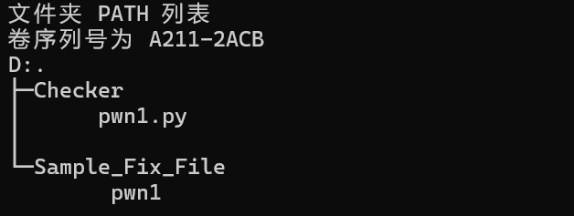

# Checker 文件内容制作指南
文件下载
----

[Checker.zip](Checker.zip)

文件包结构
-----

文件包内应确保具有如下的文件。



1.  Checker/web1.py – Checker 脚本
2.  Sample\_Fix\_File – 样例修复文件

Checker 脚本
----------

脚本样例如下，不要修改返回值和输出值，否则会被打回。

尽量只修改 \_exp 和 \_check 函数，返回值为是否 exp 成功和 check 成功，后面那个返回值是用作追踪用的。

```python
import logging
import sys
from pwn import *

class Pwn1(object):
    def __init__(self, ip, port=20003):
        self.ip = ip
        self.port = port

    def __exp(self):
        ip = self.ip
        port = self.port
        try:
            # 使用 pwntools 进行攻击
            conn = remote(ip, port)
            conn.sendline(b'GET /fix.txt HTTP/1.1\r\nHost: %s\r\n\r\n' % ip.encode())
            response = conn.recv()
            conn.close()

            if b"0" in response:
                return True, 0
        except Exception as e:
            logging.error(f"Exception in __exp: {e}")
            return False, 1

        return False, 2

    def __check(self):
        ip = self.ip
        port = self.port
        try:
            # 使用 pwntools 检查服务
            conn = remote(ip, port)
            conn.sendline(b'GET /check.txt HTTP/1.1\r\nHost: %s\r\n\r\n' % ip.encode())
            response = conn.recv()
            conn.close()

            if b"1" in response:
                return True, 0
        except Exception as e:
            logging.error(f"Exception in __check: {e}")
            return False, 1

        return False, 2

    def exec(self):
        check_result, check_point = self.__check()
        exp_result, exp_point = self.__exp()
        logging.warning("[IP:%s][PWN1][EXP]%s" % (self.ip, str(exp_result)))
        logging.warning("[IP:%s][PWN1][CHECK]%s" % (self.ip, str(check_result)))

        if exp_result == False and check_result == True:
            logging.warning("[IP:%s][PWN1][RESULT]%s" % (self.ip, str("True")))
            return exp_result, check_result, True, exp_point, check_point
        else:
            logging.warning("[IP:%s][PWN1][RESULT]%s" % (self.ip, str("False")))
            return exp_result, check_result, False, exp_point, check_point

if __name__ == '__main__':
    if len(sys.argv) != 3:
        print("Usage: python script.py <ip> <port>")
        sys.exit(1)
    
    ip = sys.argv[1]
    port = int(sys.argv[2])
    
    pwn1 = Pwn1(ip=ip, port=port)
    exp_result, check_result, final_check_result, exp_point, check_point = pwn1.exec()
    print(f"{exp_result}|{check_result}|{final_check_result}|{exp_point}|{check_point}")
```

样例修复文件
------

对服务的修复样例，要求复制到靶机之后，上面的 exp 为 0，check 为 1，才是修复成功。