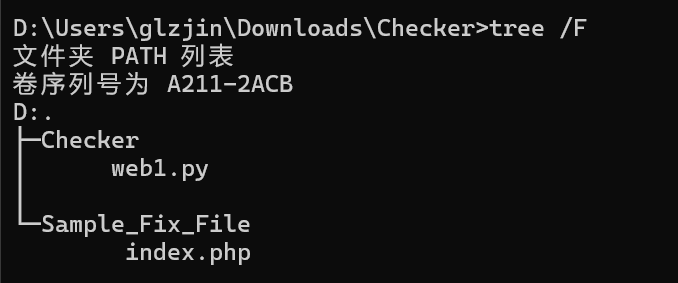

# Checker 文件内容制作指南
文件下载
----

[Checker.zip](../%E6%96%87%E4%BB%B6%E4%B8%8B%E8%BD%BD/Checker.zip)

文件包结构
-----

文件包内应确保具有如下的文件。



1.  Checker/web1.py – Checker 脚本
2.  Sample\_Fix\_File – 样例修复文件

Checker 脚本
----------

脚本样例如下，不要修改返回值和输出值，否则会被打回。

尽量只修改 \_exp 和 \_check 函数，返回值为是否 exp 成功和 check 成功，后面那个返回值是用作追踪用的。

```python
import logging

import requests
import base64
import string
import sys
import re
import uuid
import time
import json


class Web1(object):
	def __init__(self, ip, port=20003):
		self.ip = ip
		self.port = port

	def __exp(self):

		ip = self.ip
		port = self.port
		try:
			#  测试攻击是否成功   攻击成功返回True  失败返回False
			url = f"http://{ip}:{port}/fix.txt"

			response = requests.get(url)
			content = response.text
			if "0" in content:
				return True, 0

		except:
			return False, 1

		return False, 2

	def __check(self):

		ip = self.ip
		port = self.port
		try:
			url = f"http://{ip}:{port}/check.txt"

			response = requests.get(url)
			content = response.text
			if "1" in content:
				return True, 0
		except:
			return False, 1

		return False, 2

	def exec(self):
		check_result, check_point = self.__check()
		exp_result, exp_point = self.__exp()
		logging.warning("[IP:%s][WEB1][EXP]%s" % (self.ip, str(exp_result)))
		logging.warning("[IP:%s][WEB1][CHECK]%s" % (self.ip, str(check_result)))

		if exp_result == False and check_result == True:
			logging.warning("[IP:%s][WEB1][RESULT]%s" % (self.ip, str("True")))
			return exp_result, check_result, True, exp_point, check_point
		else:
			logging.warning("[IP:%s][WEB1][RESULT]%s" % (self.ip, str("False")))
			return exp_result, check_result, False, exp_point, check_point

if __name__ == '__main__':
	web1 = Web1(ip=sys.argv[1], port=int(sys.argv[2]))
	exp_result, check_result, final_check_result, exp_point, check_point = web1.exec()
	print(f"{exp_result}|{check_result}|{final_check_result}|{exp_point}|{check_point}")
```

样例修复文件
------

对服务的修复样例，要求复制到靶机之后，上面的 exp 为 0，check 为 1，才是修复成功。