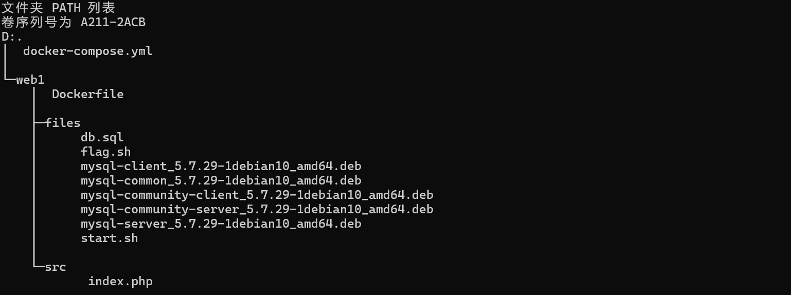

# Dockerfile 文件内容制作指南
文件下载
----

[docker-web(官方镜像源)-awdp.zip](/分类出题指南/3.%20分类/WEB-AWDP（Web安全-AWDP）/文件下载/docker-web(官方镜像源)-awdp.zip)

[docker-web(来源dasctfbase).zip](/分类出题指南/3.%20分类/WEB-AWDP（Web安全-AWDP）/文件下载/docker-web(来源dasctfbase)-awdp.zip)

和 WEB 题的不同
----------

把 SSH 打开，账号 **ctf（运维账户，给到程序文件的修改权限）**，密码 1qazcde3!@#。原因：**flag文件需要保留，接收 DASFLAG 作为flag，因为这个靶机既要作为攻击靶机（SSH信息不展示），也要作为防守靶机（SSH信息要展示）。**

文件包结构
-----

文件包内应确保具有如下的文件。



1.  docker-compose.yml – Docker-Compose 描述文件
2.  web1 – 服务构建文件，下有 Dockerfile 和构建所需的文件等

docker-compose.yml
------------------

Docker-Compose 描述文件, 内容如下：

```
# 指定该文件版本
version: '3'
# 把每个子目录视为一个镜像，开始构建
services:
  web1:
    # 此处仅允许 image, build, ports，禁止其他字段出现，如果有 volume，cmd 等设置需求，请在 Dockerfile 里进行文件拷贝或者申明。
    build: ./web1/
    ports:
      - "18098:80"
      - "18022:22"

```

**此处仅允许 image, build, ports，禁止其他字段出现，如果有 volume，cmd 等设置需求，请在 Dockerfile 里进行文件拷贝或者申明！！！**

**此处仅允许 image, build, ports，禁止其他字段出现，如果有 volume，cmd 等设置需求，请在 Dockerfile 里进行文件拷贝或者申明！！！**

**此处仅允许 image, build, ports，禁止其他字段出现，如果有 volume，cmd 等设置需求，请在 Dockerfile 里进行文件拷贝或者申明！！！**

**ports 里映射的镜像端口请务必保证正确！**

web1
----

服务构建文件，下有 Dockerfile 和构建所需的文件等。

Dockerfile 内容参考样例如下：

1.样例1 

```
# 使用基础镜像
FROM php:7.4-apache

# 拷贝支撑文件到临时目录
COPY files /tmp/files/

# 拷贝源码到相应目录下
COPY src /var/www/html/

# 执行命令，设置权限，安装依赖等
RUN chown -R root:root /var/www/html/ && \
    chmod -R 755 /var/www/html && \
    mv /tmp/files/flag.sh / && \
    mv /tmp/files/start.sh / && \
    mv /tmp/files/db.sql /db.sql && \
    chmod +x /flag.sh /start.sh && \
    sed -i 's/deb.debian.org/mirrors.aliyun.com/g' /etc/apt/sources.list && \
    sed -i '/security/d' /etc/apt/sources.list && \
    apt-get update && \
    apt-get install -y libaio1 libnuma1 psmisc libmecab2 openssh-server && \
    DEBIAN_FRONTEND=noninteractive dpkg -i /tmp/files/mysql-common_5.7.29-1debian10_amd64.deb && \
    DEBIAN_FRONTEND=noninteractive dpkg -i /tmp/files/mysql-community-client_5.7.29-1debian10_amd64.deb && \
    DEBIAN_FRONTEND=noninteractive dpkg -i /tmp/files/mysql-client_5.7.29-1debian10_amd64.deb && \
    DEBIAN_FRONTEND=noninteractive dpkg -i /tmp/files/mysql-community-server_5.7.29-1debian10_amd64.deb && \
    DEBIAN_FRONTEND=noninteractive dpkg -i /tmp/files/mysql-server_5.7.29-1debian10_amd64.deb && \
    rm -rf /tmp/files && \
    docker-php-ext-install mysqli pdo pdo_mysql && \
    rm -rf /var/lib/apt/lists/* && \
    # 设置 SSH
    mkdir /var/run/sshd && \
    useradd -m -s /bin/bash ctf && \
    echo 'ctf:1qazcde3!@#' | chpasswd && \
    chown -R ctf:ctf /var/www/html && \
    # 允许 ctf 用户通过 SSH 登录
    echo 'AllowUsers ctf' >> /etc/ssh/sshd_config && \
    # 启用密码认证
    sed -i 's/#PasswordAuthentication yes/PasswordAuthentication yes/' /etc/ssh/sshd_config && \
    # 清理
    rm -rf /var/lib/apt/lists/*

# 指定启动命令
CMD /usr/sbin/sshd && /start.sh

# 申明环境变量
ENV DASFLAG DASCTF{test12345}

# 暴露端口
EXPOSE 80 22
```

2.样例2

```
# 使用基础镜像
FROM dasctfbase/web_php73_apache_mysql

# 拷贝源码到相应目录下
COPY ./src /var/www/html

# 如需自定义 FLAG 请将自定义脚本覆盖到 /flag.sh
COPY files/flag.sh /flag.sh

# 如需操作数据库请将 sql 文件拷贝到 /db.sql
COPY files/db.sql /db.sql

# 安装 SSH 服务并设置权限
RUN apt-get update && \
    apt-get install -y openssh-server && \
    mkdir /var/run/sshd && \
    useradd -m -s /bin/bash ctf && \
    echo 'ctf:1qazcde3!@#' | chpasswd && \
    chown -R ctf:ctf /var/www/html && \
    chmod 755 /var/www/html && \
    chmod +x /flag.sh && \
    sed -i "1i \ServerName localhost:80" /etc/apache2/apache2.conf && \
    # 配置 SSH 允许 ctf 用户登录
    echo 'AllowUsers ctf' >> /etc/ssh/sshd_config && \
    sed -i 's/#PasswordAuthentication yes/PasswordAuthentication yes/' /etc/ssh/sshd_config && \
    # 清理
    rm -rf /var/lib/apt/lists/*

# 申明环境变量，这里有一个 /flag.sh 从环境变量中获取 flag，所以需要声明
ENV DASFLAG DASCTF{test12345}

# 启动 Apache 和 SSH
CMD /usr/sbin/sshd && /start.sh

# 声明对外暴露端口
EXPOSE 80 22
```

需要特别注意几点：

1\. FROM 的基础镜像只允许是：

1.   Dockerhub上不带 / 的官方镜像
2.  dasctfbase 组织下的镜像，比如 `dasctfbase/web_php73_apache_mysql` 等
3.  love-image.dasctf.com 里的镜像
    

**其他镜像一律不允许使用。**

**其他镜像一律不允许使用。**

**其他镜像一律不允许使用。**

2\. 请设置一个 DASFLAG 环境变量来作为预置的 flag 以供测试。

`ENV DASFLAG DASCTF{test12345}`

3\. 请正确声明容器对外暴露的端口。

`EXPOSE 80`

4\. CMD 及其附属的启动脚本**禁止使用**输出文字等方式来保持运行。

比如

```

while true; do
  echo '1'
done
```

禁止使用这种输出日志的方式来保持运行。

禁止使用这种输出日志的方式来保持运行。

禁止使用这种输出日志的方式来保持运行。

5\. 把 SSH 打开，账号 ctf（运维账户，给到程序文件的修改权限），密码 1qazcde3!@#。原因：flag文件需要保留，接收 DASFLAG 作为flag，因为这个靶机既要作为攻击靶机（SSH信息不展示），也要作为防守靶机（SSH信息要展示）。