# 账号注册和登录
1.  打开平台首页 [https://love.dasctf.com/#/index](https://love.dasctf.com/#/index) 。
    
    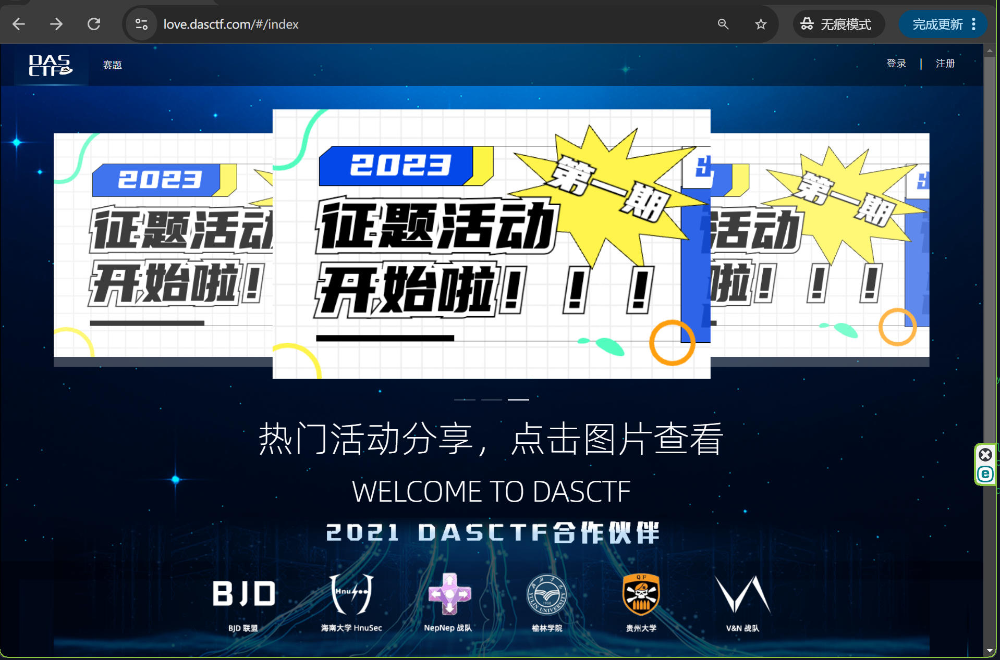
    
2.  点击右上角“注册”按钮，进入 MYDAS注册/登录 页面。
    
    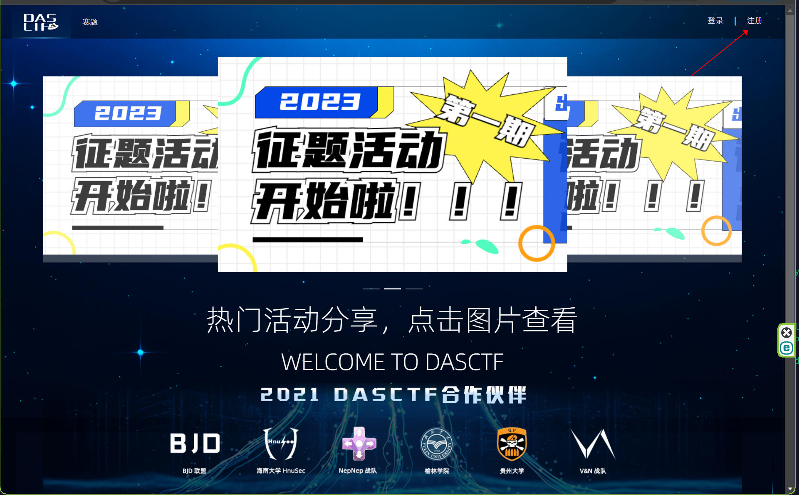
    
    3\. 在这个界面可以输入手机号，接收验证码进行登录，也可绑定第三方平台进行登录。
    
    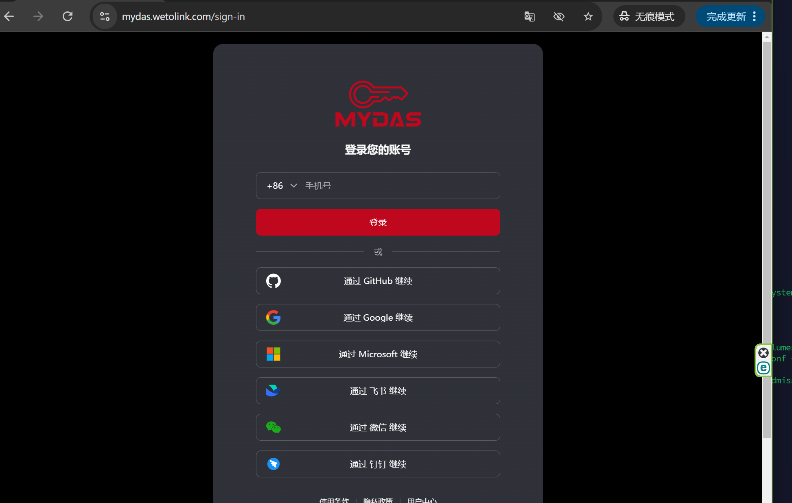
    
    如果您需要使用手机号登录：
    
    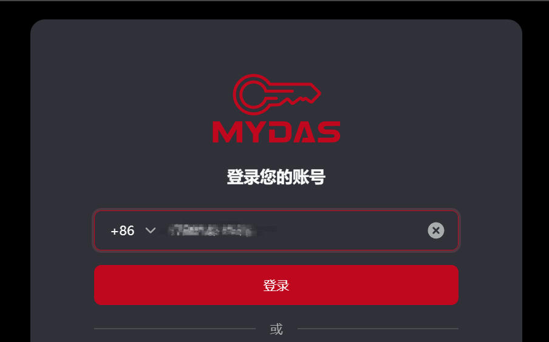
    
    在这里输入手机号后，点击登录，会发送手机号到您的手机上，输入验证码继续。
    
    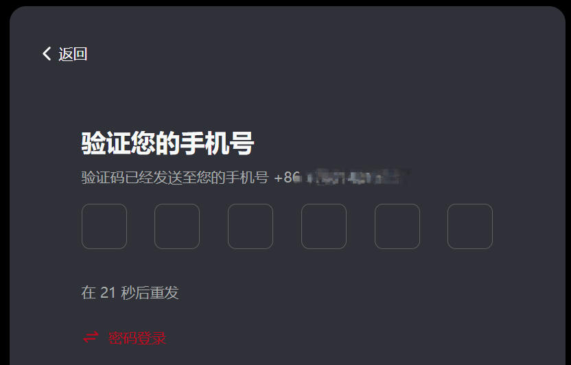
    
    在下一步会问是否开启两步验证，可依据自己需求选择是否开启，开启时请务必注意保存恢复代码。
    
    如果您选择使用第三方平台进行登录：
    
    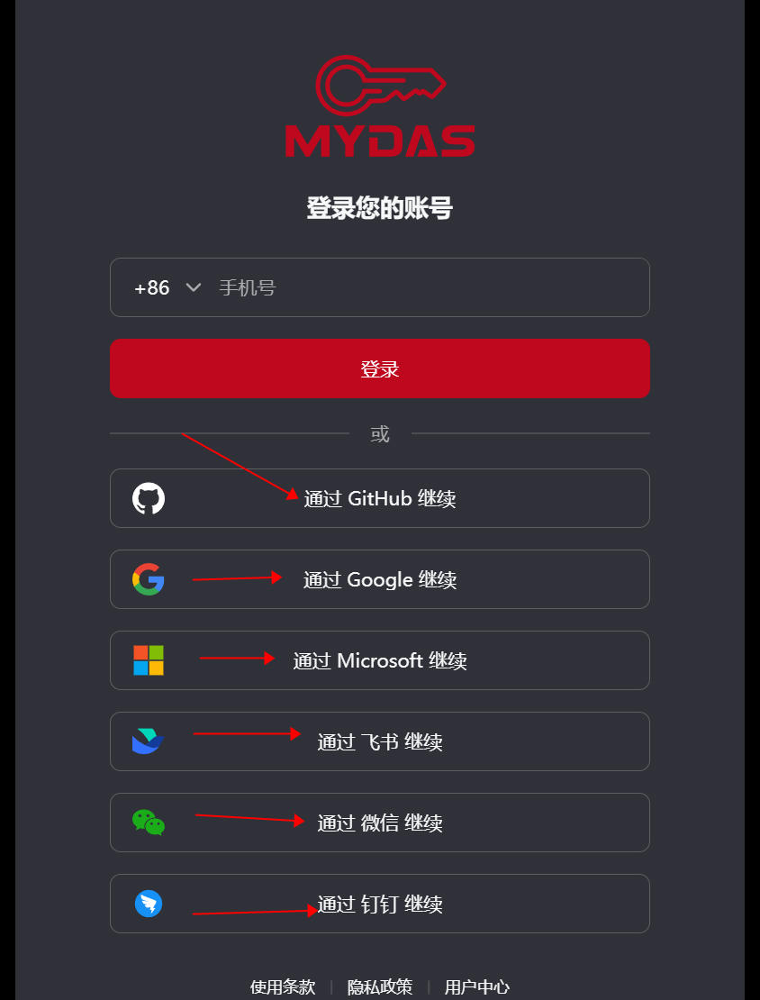
    
    会跳转到对应的第三方平台要求登录。
    
    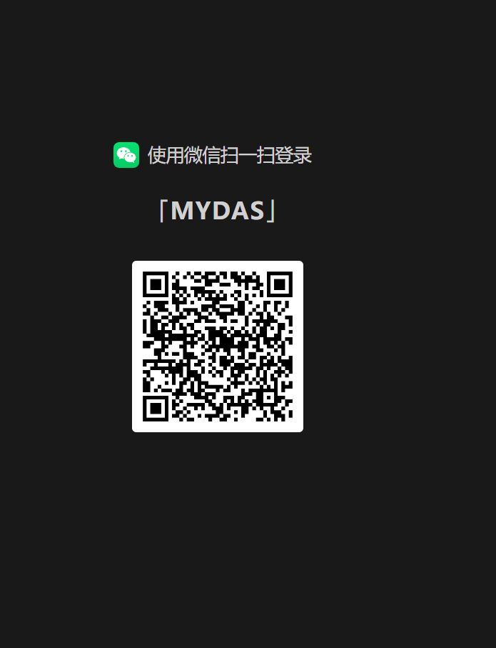
    
    登录完成跳转回来之后会提示输入手机号，然后依照上面手机号登录的步骤进行手机号输入和短信验证码验证，即可将第三方平台账号和 MYDAS 账号进行绑定。
    
    4\. 然后就会询问是否授权，点击“验证”按钮即可。
    
    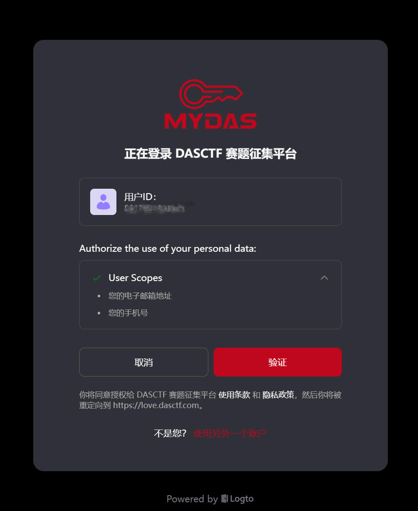
    
    5\. 这时会跳转回平台，询问是否创建新账号，点击确定即可完成注册。
    

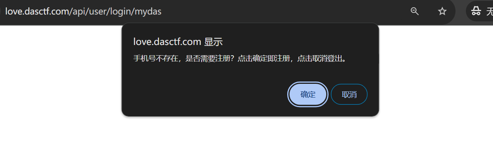

6\.  后续登录点击首页的“登录”按钮，再点击“使用 MYDAS 登录”即可登录。

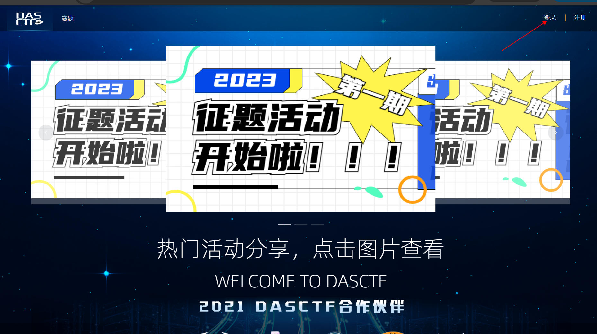

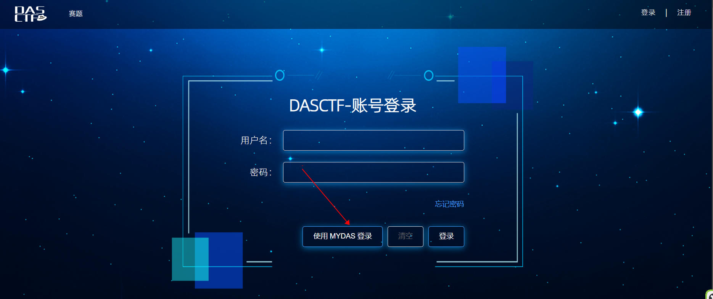